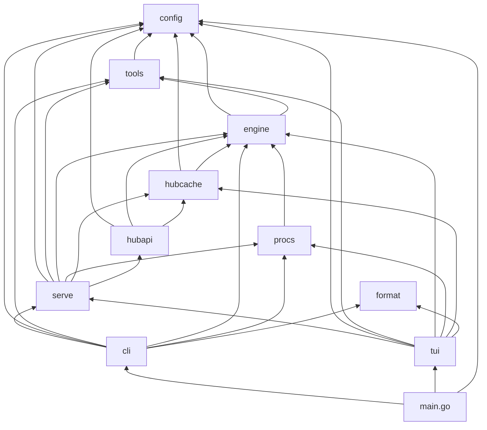
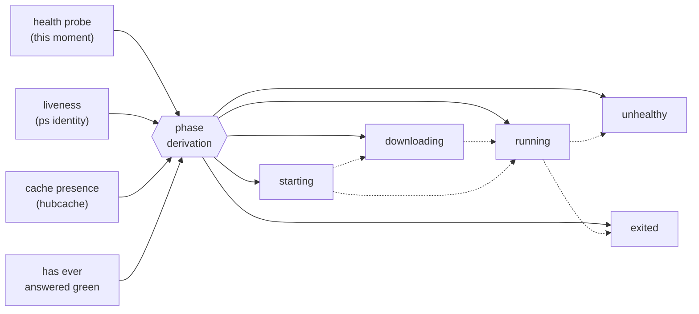

# cria — architecture

How the binary is put together: the packages, what may reach what, where the
information comes from, and what lands on a host. The *contracts* live in
`docs/specs/` — this document points at them rather than repeating them, and the
philosophy they serve is `docs/cria.md`.

## Module boundaries

One module (`cria`), one command, one package per subsystem under `internal/`.
`main.go` does the wiring and nothing else: it scaffolds the config tree and hands
the command line to `cli`, passing `tui.Run` as the program bare `cria` opens.

| package | what it owns | entry point | may import |
| --- | --- | --- | --- |
| `internal/config` | the config tree, its schema, the schema's own documentation, and how an args list pairs into flag groups (`specs/CONFIG.md`) | `Load(root)`, `FlagGroups(args)` | — |
| `internal/format` | how a size, a duration and a Hub reference are spelled | `Bytes`, `HubReference`, … | — |
| `internal/tools` | which managed programs the host has and what each one's state disables (`specs/TOOLS.md`) | `Check(settings)` | `config` |
| `internal/engine` | what cria knows about each way of serving: the program, the model reference, the endpoints, the warm and slot rules (`specs/SERVE.md`) | `For(backend)`, `All()` | `config`, `tools` |
| `internal/procs` | every `ps`/`lsof` exec and every signal cria sends (`specs/SERVE.md`) | `System{}` (a `Host`) | `engine`, `tools` |
| `internal/hubcache` | the cache walk, true blob-deduped sizes, entry presence, and the delete plans (`specs/CACHE.md`) | `Read(root)`, `Plan*`/`Execute` | `config`, `engine` |
| `internal/hubapi` | what a model comes to when complete, and the HF token | `New()`, `Token()` | `config`, `engine`, `hubcache` |
| `internal/serve` | a managed server's life: compose, spawn detached, record, observe, stop (`specs/SERVE.md`) | `New(root, host)` | `config`, `tools`, `engine`, `procs`, `hubcache`, `hubapi` |
| `internal/cli` | parsing, ordering and output for the subcommands (`specs/CLI.md`) | `Dispatch(args, version, tui)` | `config`, `tools`, `engine`, `procs`, `serve`, `format` |
| `internal/tui` | the program frame and its screens (`specs/TUI.md`) | `Run()` | `config`, `tools`, `engine`, `procs`, `serve`, `hubcache`, `format` |

The graph is acyclic and layered — leaves that only read the world, then the
lifecycle over them, then the two faces (CODING-RULES §7). Two rules hold it that
way:

- **A subsystem is reached through its entry point and nothing else.** Composing
  two of them — where the config tree lives *and* where the cache lives — is the
  caller's wiring, not a subsystem's business.
- **Judgement belongs to the layer that owns the question.** `procs` reports what
  the operating system said; `serve` decides live versus exited. `hubcache` and
  `tools` report data; `cli` and `tui` decide how it reads.
- **Per-engine knowledge lives in one place.** `engine` answers what differs
  between ways of serving — the program to run, how a model is named on its
  command line, which endpoints it publishes, whether a green server has loaded
  its weights — and does none of it: `serve` spawns, probes and requests.
  Everything else asks rather than branching, and the lookup refuses a backend no
  engine claims instead of defaulting to one. What "already downloaded" means is
  the same kind of question, so `hubcache` and `hubapi` ask it too (settled
  2026-08-31): a reference qualified by a quantization is one file set out of a
  repo, one that is not is the whole repo.
- **The per-backend schema metadata stays in `config`** (settled 2026-08-31).
  `engine` imports `config`, so the keys a backend takes and the example values
  it takes them at cannot be declared with the engines without a cycle; `config`
  owns that registry and the enum, and `engine`'s own test holds the two sets to
  being one. Display is the mirror case: which colour an engine's name is drawn
  in and which order the toggle walks are `tui` decisions keyed by engine id —
  an engine module renders nothing.

`serve` never imports `hubcache`'s delete side and `hubcache` never imports
`serve`: the surgery guard takes the running servers as a list its caller
assembles, which is what keeps deletion and serving from depending on each other.

## Data flow

Four sources of truth feed everything cria shows, and cria owns none of them.

**The config tree → entries → a launch.** `~/.config/cria/` is written by people
and coding agents; `config.Load` reads it into resolved entries (port and host
already folded in from `config.toml`) and reports the files it refused. `serve`
composes one command line per entry and spawns it; the TUI re-reads the tree every
tick, because an agent writing a new entry while cria is open is the expected flow.
Nothing writes back — `cria docs` prints the schema from the same definitions the
parser uses, so the documentation an agent writes against cannot drift from the
binary.

**The hub cache → sizes, presence, progress.** `hubcache.Read` walks
`~/.cache/huggingface/hub` directly: blob-deduped sizes for the cache view,
whether an entry's model is fully present (the cached dot, and the *downloading*
phase), and the bytes-on-disk that are a download's numerator. Deletion is the
only write, and it happens in two steps — a plan states exactly what would go, and
`Execute` removes exactly that plan after re-deriving it against the cache as it
now stands.

**The Hub API → the denominator.** `hubapi` answers how big a model is when
complete. It is optional by construction: an unreachable Hub costs the progress
display its percentage and nothing else, and never blocks a start.

**`ps` and `lsof` → identity and attribution.** `procs` is the single route to the
process table. It answers four questions: is this pid the process cria recorded
(command arguments and start time, so a recycled pid cannot impersonate a dead
server), what does it cost, which server processes exist — the foreign scan,
looking for the programs the engines name — and who holds a port (the attributed
refusal).

**Server logs flow one way: to the screen.** They are tailed raw and never parsed
for data (`docs/cria.md`, principle 6).

Observation is a derivation, not a state machine: liveness, this moment's health
probe, cache presence and whether the server has ever answered green go in, one
phase comes out. `cria status` takes one such observation; the TUI takes one per
tick.

Phase meanings and the rules behind them are `docs/specs/SERVE.md`.

## Deployment shape

One static binary per host, no cgo, no daemon (`docs/TECH-STACK.md`,
`docs/cria.md` principles 3 and 7). `go build` on the dev Mac, `scp` to the target,
run it. Servers are spawned detached in their own session: cria may exit at any
moment, and the next invocation re-attaches by reading its state records back.

cria writes to exactly two trees and reads a third it does not own:

| tree | who writes it | what is in it |
| --- | --- | --- |
| `~/.config/cria/` | people and coding agents; cria creates the root, `models/` and `AGENTS.md` when missing | `config.toml`, one `models/<id>.toml` per launchable entry |
| `~/.local/state/cria/` | cria alone | `servers/<id>.json` state records, `logs/<id>-<stamp>.log` (newest three per entry), `ui.json` UI memory |
| `~/.cache/huggingface/hub/` | `hf` and the servers; cria only through a delete plan | every model byte on the host — the single source of truth |

The cache location is resolved the way `huggingface_hub` resolves it
(`HF_HUB_CACHE`, then `HF_HOME`, then the XDG cache directory), so cria reads
exactly the tree the tools write. The other two trees are fixed paths on both
platforms.

The host provides `llama-server`, `mlx_lm.server` and `hf`. cria detects them,
reports what a missing or unfit one disables, and installs nothing.
